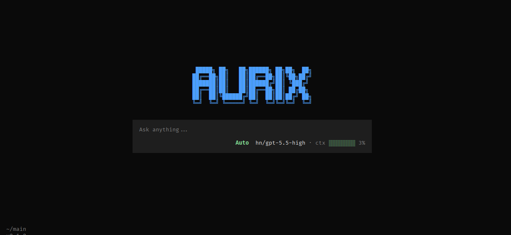

# AURIX

<p align="center">
  
  
  
  
  
  
</p>

<p align="center">
  <b>Open-source terminal AI agent that codes, researches, browses, and solves — with real hands.</b>
</p>

<p align="center">
  AURIX is a developer-first AI workspace that lives in your terminal.<br/>
  It inspects repos, edits files, runs commands, performs cited research, automates stealth browsers<br/>
  with built-in CAPTCHA solving, generates documents — and stays accessible from Discord, Telegram, and WhatsApp.
</p>

---

<!--
  TODO: Add terminal demo GIF here
  Record with: asciinema rec demo.cast && agg demo.cast demo.gif
  Or use: terminalizer record demo && terminalizer render demo
-->



## What is AURIX?

AURIX is an **Autonomous Multi-Agent AI Workspace**. It is not a chat wrapper — it is an AI that has hands, eyes, and memory. 

**It can automatically control your social media, upload content, conduct deep research on it, and solve any CAPTCHA with hybrid AI audio-visual models.**

Instead of just generating text, AURIX operates directly inside your environment to close the execution loop. It comes packed with **46+ built-in tools**, a **Rust-powered token counter** for accurate context management, a **stealth browser engine** with CAPTCHA solving, and **100+ CTF/security skills** for offensive security testing.

1. **It Reads & Browses:** Navigates your folders, reads your codebase, searches the web, and automates a stealth Chromium browser (CloakBrowser) that solves CAPTCHAs including image challenges, sliders, and FunCaptcha.
2. **It Thinks:** Delegates complex tasks to a swarm of sub-agents. Accurate BPE token counting via a native Rust module ensures context is never wasted.
3. **It Acts:** Writes files, runs shell commands, creates Git commits, manages Docker containers, queries databases, drags sliders, and clicks image tiles.
4. **It Verifies:** If a test fails or a build crashes, AURIX reads the error log and fixes the code autonomously.
5. **It Hunts:** Ships with 100+ CTF and penetration testing skills covering web exploitation, binary pwn, crypto, reverse engineering, forensics, OSINT, and AI/ML security.

## Standout Features

### Stealth Browser with CAPTCHA Solving

AURIX ships with **CloakBrowser** — a patched Chromium with source-level anti-detection that passes reCAPTCHA scoring, Cloudflare Turnstile, and fingerprint checks. The built-in CAPTCHA solver handles:

| CAPTCHA Type | Method | Success Rate |
|---|---|---|
| **reCAPTCHA v2** | Hybrid solver: image grid AI vision + audio bypass (Whisper STT) with human-like clicking | **95%+** hybrid mode |
| **hCaptcha** | Same image grid solving flow | ~80% with vision model |
| **Cloudflare Turnstile** | Managed challenge auto-click | ~90% |
| **FunCaptcha (Arkose Labs / Microsoft)** | Puzzle type detection + rotation, drag-drop, image-match solving | ~75% |
| **GeeTest / MTCaptcha** | Slider drag with human-like easing + micro-jitter | ~85% |
| **Text CAPTCHA** | Screenshot + OCR via AI vision | ~95% |

**NEW: Hybrid Audio + Image Solver** — AURIX now supports a hybrid captcha solving mode:
- **Image mode**: AI vision analyzes grid tiles, picks matches, clicks with human-like behavior
- **Audio mode**: Clicks audio button, downloads audio challenge, transcribes with Whisper (local or Groq API), types answer
- **Hybrid mode** (default): Tries image first, falls back to audio if image fails
- Auto-detects non-vision models and switches to audio mode automatically
- Supports Groq Whisper API (free 2000 req/day) or local Whisper installation

```yaml
# config.yaml
captchaAudio: "hybrid"    # "image" / "audio" / "hybrid"
groqApiKey: gsk_xxx       # Get free key: https://console.groq.com/docs/speech-to-text
```

**Best model for CAPTCHA:** Use **Gemini** — Google owns both reCAPTCHA and Gemini, so Gemini understands reCAPTCHA's image challenges better than any other model. Any vision-capable model works. Non-vision models auto-switch to audio mode.

New browser actions: `captcha-grid`, `click-tile`, `captcha-verify`, `drag-to`, `hold-click` — all with human-like mouse behavior (eased curves, random delays, micro-jitter).

### Rust-Powered Token Counter

Token counting was wildly inaccurate (`Math.ceil(text.length / 4)` underestimates by 30-60% for code). Now uses a **native Rust BPE tokenizer** via napi-rs:

- **tiktoken-rs** with `cl100k_base` (GPT-4) and `o200k_base` (GPT-4o) encodings
- Accurate context management — no more premature overflow or wasted context window
- Real API usage tracking from `response.usage.promptTokens` / `completionTokens`
- Automatic JS fallback if Rust toolchain unavailable

### Bug Hunt Skill — 100+ CTF & Security Skills

Bundled with comprehensive offensive security skills covering every CTF category:

| Category | Files | Covers |
|---|---|---|
| **Web** | 20 | SQLi, XSS, SSTI, SSRF, JWT, prototype pollution, file upload RCE, 500+ techniques |
| **Pwn** | 18 | Buffer overflow, ROP, heap, format string, kernel exploitation, seccomp bypass |
| **Crypto** | 16 | RSA, AES, ECC, PRNG, ZKP, lattice, Coppersmith, padding oracle |
| **Reverse** | 18 | ELF/PE analysis, VMs, WASM, obfuscation, game clients |
| **Forensics** | 14 | Disk images, memory dumps, PCAP, steganography, event logs |
| **Misc** | 12 | Jails, encodings, RF/SDR, esoteric languages, game theory |
| **Malware** | 3 | C2 traffic, packers, .NET analysis |
| **OSINT** | 3 | Social media, geolocation, DNS, public records |
| **AI/ML** | 3 | Adversarial examples, prompt injection, model extraction |

## What's New in v2.12.0

.0

### Autonomous Email Verification & OTP Extraction
AURIX can now autonomously sign up for services requiring email verification:
- **TempMail API integration**: Generates throwaway email addresses on the fly
- **Inbox Polling & Auto-Extraction**: Waits for incoming emails and uses Regex to automatically extract 4-8 digit OTPs or verification links — no need for the LLM to read bloated HTML emails
- **Browser Actions**: Exposed via `get-temp-email` and `wait-email` browser tools

### Interactive Human-in-the-Loop (HITL) Prompting
When AURIX needs real user credentials (not throwaway) or encounters an MFA prompt, it pauses execution without wasting tokens:
- **CLI Mode**: Pauses terminal execution and shows an interactive prompt asking you to paste the OTP.
- **Gateway Mode**: When running on Telegram, Discord, or WhatsApp, the agent stops and sends you a message ("Send your OTP for login"). It resumes only when you reply.
- **Under the hood**: Driven by the new `ask_user` tool that suspends the Promise loop.

### Human-like Browser Behaviors
Further reducing bot-detection across Arkose and Cloudflare:
- **Human-like Scroll**: Ease-out cubic animation with variable steps and a 20% chance of overshooting the target and correcting back.
- **Human-like Typing (`humanType`)**: Types with dynamic character delays, 5% QWERTY-proximity typo probability, and natural backspace corrections. 
- **Persona-Anchored Fingerprinting**: 5 realistic hardware combinations (e.g. Windows RTX 3080 Gamer, MacBook Pro M1) instead of randomized fingerprints.

### Hybrid CAPTCHA Solver (Image + Audio)
The biggest upgrade yet — AURIX now solves CAPTCHAs using a **hybrid approach**:
- **Image grid solver** with enhanced preprocessing (normalize, sharpen, saturation boost) for better small-object detection
- **Audio bypass** using Whisper STT (Groq API or local) to transcribe audio challenges
- **3x3 flip solver** with canvas-based flip detection and multi-round re-clicking
- **4x4 grid solver** with grid-level analysis and per-tile fallback
- **Non-vision model auto-detection** — automatically switches to audio mode if your model doesn't support vision
- **Telegram status** now shows `using_tools: $command` instead of generic "Writing response..."

```bash
# Install with hybrid captcha support
npm i -g aurix-ai

# Setup Groq API key for audio bypass (free 2000 req/day)
# Get key at: https://console.groq.com/docs/speech-to-text
aurix setup
```

### Telegram Tools Fix
- All "features" renamed to "tools" for consistency
- Status messages now show `using_tools: $tool_name` format
- Unknown commands properly handled as tool invocations

## What's New in v2.9.x

### MCP Server Manager (`/mcp`)
Full **Model Context Protocol** integration — connect external tool servers directly into AURIX:

```text
/mcp              # Open interactive TUI manager
/mcp presets      # Browse built-in server presets (GitHub, Gmail, PostgreSQL, etc.)
/mcp catalog      # Search online MCP server catalog
/mcp connect      # Add a server from presets
/mcp reload       # Restart all running MCP servers
```

- **Subprocess transport** — JSON-RPC 2.0 over stdio, servers run as child processes
- **Interactive TUI** — Arrow-key navigation, space toggle enable/disable, add/remove servers
- **Auto-registration** — MCP tools are registered as AURIX tools on startup
- **10 built-in presets** — GitHub, Filesystem, PostgreSQL, SQLite, Brave Search, Puppeteer, Slack, Memory, Fetch, Sequential Thinking
- **Online catalog** — Browse and search from the official MCP server registry

### Memory Enrichment
When you save something to memory, AURIX **rephrases it with an LLM** before storing — making memories 2-5x richer with implicit context:

```text
You say: "kenapa pupuk ga boleh kebanyakan"
Stored:  "User menanyakan tentang batas dosis pemupukan pada tanaman —
          kelebihan pupuk menyebabkan burn akar, akumulasi garam tanah,
          dan gangguan penyerapan air akibat osmotic stress"
```

- Same language preserved (Indonesian in → Indonesian out)
- Adds domain context, scope, caveats that were implicit
- Self-contained — makes sense when recalled months later
- Fallback to raw input if LLM enrichment fails

### Update Notifications
Automatic version check against npm registry on startup. If a newer version exists:

```text
╭──────────────────────────────────────────────╮
│  New version available!  2.9.1 → 2.9.7      │
│  Run: npm update -g aurix-ai                │
╰──────────────────────────────────────────────╯
```

- Cached for 24 hours (no spam, no API hammering)
- Non-blocking — doesn't slow down startup

### OS-Aware System Prompt
AURIX now detects your operating system and adjusts its command cheatsheet:
- **Windows:** Blocks Linux commands (`ls`, `grep`, `cat`, `find`) — uses PowerShell equivalents
- **macOS:** BSD-flavored hints (different `sed`, `find`, `xargs` behavior)
- **Linux:** Standard GNU coreutils

### Windows Fixes
- **No more about:blank** — 3-attempt navigation retry + removed random proxy injection
- **No more --no-sandbox warning** — monkey-patch strips flag from all Chromium launches
- **OpenTUI FFI** — auto-probes `node:ffi` availability, conditional flag injection
- **Copy/paste** — bracketed paste mode + ESC buffering in setup wizard

### Other v2.9.x Improvements
- **46+ tools** including new captcha training data for improved accuracy
- **Modular captcha solver** — split into separate modules for better maintainability
- **Session browser** — resume past sessions from the TUI
- **Theme system** — 6+ color themes with border style customization

## Real-World Use Cases

### The "Hands-Free" Developer
> **You:** *"Look at `auth.ts`. There's a bug where JWT tokens expire too early. Fix it, run the test suite, and if it passes, push it."*
> **AURIX:** Reads the file, edits the code, runs tests, sees an error, fixes it, runs again, executes `git push`.

### The Deep Researcher
> **You:** *"Write a 5-page PDF report on how Vercel alternatives are perceived on Reddit and HackerNews."*
> **AURIX:** Spawns a 13-agent research pipeline. Scrapes forums, debates claims, compiles data into markdown, converts to styled PDF.

### The Browser Automator
> **You:** *"Go to this site, fill the registration form, solve whatever CAPTCHA pops up, and submit."*
> **AURIX:** Opens stealth browser, fills form, detects reCAPTCHA image challenge, screenshots each tile, uses vision to pick matching images, clicks verify.

### The CTF Player
> **You:** *"Here's a challenge file. Find the flag."*
> **AURIX:** Triages the file, categorizes it (crypto? web? pwn?), loads the matching Bug Hunt sub-skill, applies specialized techniques, captures the flag.

## Key Features

- **Terminal-First UI (TUI):** Beautiful, interactive CLI built with OpenTUI (React-based).
- **Multi-Platform Gateway:** Access from Terminal, Discord, Telegram, or WhatsApp. Memory and context persist everywhere.
- **MCP Server Manager:** Connect external tool servers (GitHub, databases, APIs) via `/mcp` with interactive TUI.
- **Memory Enrichment:** LLM rephrases memories before storing — 2-5x richer recall with implicit context preserved.
- **Self-Extending:** `> install skill from github.com/user/awesome-skill` — clones, validates, and rebuilds without restarting.
- **Accurate Token Counting:** Native Rust BPE tokenizer prevents context waste.
- **Stealth Browser:** CloakBrowser with source-level Chromium patches, human-like behavior, and full CAPTCHA solving (86% reCAPTCHA v2 success rate).
- **Auto-Update Check:** Notifies you when a new version is available on npm.
- **OS-Aware:** Detects your platform and adjusts commands (no `ls` on Windows, no `dir` on Linux).
- **1000 Iteration Limit:** Agents can work on complex tasks without hitting premature limits.

## How It Works Under the Hood

AURIX is powered by a LangGraph-based architecture that orchestrates multiple specialized AI agents:

1. **The Orchestrator (Supervisor Agent):** Analyzes your request and delegates to specialist agents.
2. **The Specialists:** Code Reviewer, Security Analyst, Deep Researcher, CTF Player — working in parallel.
3. **The Execution Engine:** 46+ built-in tools including a stealth browser, Rust token counter, and Docker manager.
4. **The Verification Loop:** A Critic Agent reviews output before returning. If execution fails, the loop retries with exponential backoff.

## Quick Start

### Requirements

- **Node.js 22+** or [Bun](https://bun.sh) v1.0+
- API key for at least one LLM provider (OpenAI, Anthropic, or others)
- Rust toolchain (optional — improves token counting accuracy)
- Python 3.12+ (optional, for research-forums skill)

### Install via npm (Recommended)

The fastest way to get started. Works on any machine with Node.js 22+.

```bash
npm install -g aurix-ai
```

Then run:
```bash
aurix setup     # Configure LLM provider + API key (first time only)
aurix           # Launch the terminal AI workspace
```

That's it. The `aurix` command is now available globally in your terminal.

To update later:
```bash
npm update -g aurix-ai
```

### Install via Git Clone (For Development)

Use this method if you want to modify the source code or contribute.

```bash
git clone https://github.com/DekaPrayoga/AurixAgent.git
cd AurixAgent
npm install         # installs dependencies + builds Rust token counter
npm run build       # compiles TypeScript
npm link            # links `aurix` command to your PATH
```

After linking, `aurix` works from any directory:
```bash
aurix setup
aurix
```

### Building the Rust Token Counter (Optional)

The npm package ships with a pre-built `.node` binary (7.2 MB). If you install from source and have Rust installed, the postinstall script automatically builds it via napi-rs.

**Why does the Rust build directory take ~150 MB?** The `target/release/deps/` folder contains ~147 MB of intermediate `.rlib` compilation files — one for every crate in the dependency tree (tiktoken-rs embeds the full BPE vocabulary of 100k+ tokens). The final compiled binary is only 7.2 MB, and that's the only file included in the npm package.

If Rust is not available, the agent falls back to a JS-based token counter automatically — no functionality is lost, just slightly less accurate counting.

```bash
# Install Rust (if not already installed)
curl --proto '=https' --tlsv1.2 -sSf https://sh.rustup.rs | sh

# Then rebuild the native module
cd native/token-counter
npx napi build --release --platform
```

## Usage

### 1. Initial Setup
```bash
aurix setup        # Configure LLM provider, API key, model
```

### 2. Start Interactive Session
```bash
aurix              # Launch the terminal AI workspace
```

### 3. Start Multi-Platform Gateway
```bash
aurix gateway      # Run as Discord/Telegram/WhatsApp bot
```

### Other Commands
```bash
aurix sessions     # List previous sessions
aurix --resume ID  # Resume a specific session
aurix update       # Update to latest version
aurix --help       # Show all commands
```

## Architecture

```text
src/
  agent/       Core agent loop, context, memory, TokenCounter
  tools/       46+ tools (Browser, Research, Docker, Git, etc.)
  mcp/         MCP client, registry, catalog, tool adapter
  cli/         Terminal UI (React Ink + raw stdin TUI)
  gateway/     Discord / Telegram / WhatsApp integration
  providers/   LLM providers (OpenAI, Anthropic, LangChain)
  skills/      Skill registry and loader
  utils/       Update check, ASCII logo, helpers

native/
  token-counter/   Rust BPE tokenizer (tiktoken-rs via napi-rs)
    Cargo.toml     Rust crate config
    src/lib.rs     count_tokens(), count_tokens_batch()

skills/
  bug-hunt/        100+ CTF & security testing skills
    ctf-web/       Web exploitation (SQLi, XSS, SSTI, SSRF, JWT...)
    ctf-pwn/       Binary exploitation (ROP, heap, kernel...)
    ctf-crypto/    Cryptography (RSA, AES, ECC, PRNG, ZKP...)
    ctf-reverse/   Reverse engineering (ELF/PE, VMs, WASM...)
    ctf-forensics/ Forensics (disk, memory, PCAP, stego...)
    ctf-misc/      Jails, encodings, RF/SDR, game theory
    ctf-malware/   Malware analysis (C2, packers, .NET)
    ctf-osint/     OSINT (social media, geolocation, DNS)
    ctf-ai-ml/     AI/ML security (adversarial, prompt injection)
    ctf-writeup/   Write-up generator
```

## The Arsenal: 46+ Built-in Tools

| Category | Capabilities |
| --- | --- |
| **File & Code** | Read, write, edit, search files, terminal exec, code sandbox |
| **Browser** | Stealth Chromium (CloakBrowser), CAPTCHA solving (reCAPTCHA, hCaptcha, FunCaptcha, Turnstile, GeeTest, sliders), drag-to, hold-click, persistent profiles |
| **Web** | Web search, scraper, YouTube |
| **Office** | PDF, Excel, PowerPoint generation, SMTP Email |
| **DevOps** | Docker, VPS management, deployments, cloud provisioning |
| **Finance** | Trading analysis, EVM/Solana blockchain tools |
| **Security** | Bug Hunt skills (100+ CTF techniques), OSINT, vulnerability scanning |
| **Creative** | GIF search, text humanizer, architecture diagrams |
| **Utility** | Maps, notifier, music player, todo, memory |
| **GitHub** | PR creation, issue management, repo info |
| **MCP** | Full MCP server manager with interactive TUI, subprocess transport, auto-tool registration, online catalog |
| **Planning** | Project planning, Kanban, story decomposition |

## Self-Extension

AURIX can install new skills from any GitHub repository at runtime:

```text
> install skill from github.com/user/awesome-skill
```

It clones, validates, registers, and rebuilds automatically. No restart needed.

## Supported LLM Providers

- **Google Gemini** — Recommended for CAPTCHA solving (Google owns reCAPTCHA + Gemini)
- OpenAI (GPT-4, GPT-4o, etc.)
- Anthropic (Claude 3.5, Claude 4)
- Any OpenAI-compatible endpoint
- LangChain integrations

> **Tip:** For best CAPTCHA solving results, use a vision-capable model with 700B+ parameters. Gemini excels at reCAPTCHA since Google built both systems.

## Environment Variables

```bash
cp .env.example .env
```

Key variables:
- `OPENAI_API_KEY` — OpenAI access
- `ANTHROPIC_API_KEY` — Anthropic access
- `DISCORD_TOKEN` — Discord bot gateway
- `TELEGRAM_BOT_TOKEN` — Telegram gateway
- `BRAVE_API_KEY` — Enhanced web search (optional)

## License

MIT
